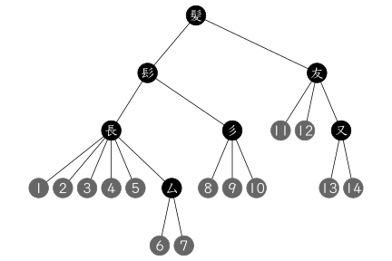

# kanjistat

  <!-- badges: start -->
  [](https://github.com/dschuhmacher/kanjistat/actions/workflows/check-standard.yaml)
  <!-- badges: end -->

kanjistat offers tools for processing and analyzing Japanese kanji characters. You can look up readings and meanings along with further dictionary information (to a large part provided by [KANJIDIC2](https://www.edrdg.org/wiki/index.php/KANJIDIC_Project)) including morphological details. You can plot kanji in your favorite font and process the resulting bitmap. You can represent kanji as nested lists of stroke paths (based on original data by [kanjiVG](https://kanjivg.tagaini.net/)), plot components in different color or display the tree structure, and analyze these decompositions and their individual strokes. Various old and new distance functions between kanji are implemented.

  
  |  |  |
  |:----------:|:----------:|

  |  |  |
  |:----------:|:----------:|


Comments, suggestions and contributions are welcome! For more info, see the [contribution guide](https://github.com/dschuhmacher/kanjistat/blob/main/.github/CONTRIBUTING.md).


## Installation

Install directly from GitHub by saying in R
```r
remotes::install_github("dschuhmacher/kanjistat")
```
If you want to use the function `kanjidist`, you will have to install the [GNU Linear Programming Kit](https://www.gnu.org/software/glpk/) (and the R package `ROI.plugin.glpk`). To work with precomputed `kanjivec` objects and the distance matrix used for the [kanjidist website](https://www.kanjidist.org), download the R data package [kanjistat.data](https://github.com/dschuhmacher/kanjistat.data) via
```r
remotes::install_github("dschuhmacher/kanjistat.data")
```


## Getting started

Kanji are represented in three different ways in this package:

1. as **characters** (or their Unicode codepoints) in the console.

1. as **`kanjimat` objects**, i.e., bitmaps using a certain font-family and possibly other typographical parameters.

1. as **`kanjivec` objects**, i.e., nested lists of strokes given as paths. Recently these objects have become much more important than the `kanjimat` objects. 

See `vignette("kanjistat")` for the basics and `?kanjivec` and `?kanjidist` for more information on the third point. Alternatively, visit the pkgdown page at <https://dschuhmacher.github.io/kanjistat/>.


## License 

`kanjistat` is free software: you can redistribute it and/or modify
it under the terms of the GNU General Public License as published by
the Free Software Foundation, either version 3 of the License, or
(at your option) any later version.

This package is distributed in the hope that it will be useful,
but WITHOUT ANY WARRANTY; without even the implied warranty of
MERCHANTABILITY or FITNESS FOR A PARTICULAR PURPOSE. See the
GNU General Public License for more details.

A copy of the GNU General Public License is in the file LICENSE.md
and at <https://www.gnu.org/licenses/>.


## Attribution of prior work


The code in the file `R/svgparser_lite` is slightly altered from R package  
`svgparser` v0.1.2 --- Copyright &copy; 2021 <mikefc@coolbutuseless.com>  
made available under an MIT License at  
<https://github.com/coolbutuseless/svgparser>

The data sets `kbase`, `kmorph` and `kreadmean` are mostly derived from  
KANJIDIC2 --- Copyright &copy; James William Breen and The Electronic Dictionary
              Research and Development Group (EDRDG)  
made available under a [CC BY-SA 4.0 License](https://creativecommons.org/licenses/by-sa/4.0/) at  
<https://www.edrdg.org/wiki/index.php/KANJIDIC_Project>

The variable `components` of data set `kmorph` is derived from  
RADKFILE/KRADFILE --- Copyright &copy; James William Breen and The Electronic
                      Dictionary Research and Development Group (EDRDG)  
made available under a [CC BY-SA 4.0 License](https://creativecommons.org/licenses/by-sa/4.0/) at  
<https://www.edrdg.org/wiki/index.php/Main_Page>

The variables `jlpt`, `frank` and `idc` of data sets `kbase` and `kmorph` are taken from  
Kanjium --- Copyright &copy; Uros O. on any additions or modifications
            from previous sources  
made available under a [CC BY-SA 4.0 License](https://creativecommons.org/licenses/by-sa/4.0/) at  
<https://github.com/mifunetoshiro/kanjium>

The data set `fivebetas` is derived from five of the svg files in  
KanjiVG --- Copyright (C) 2009-2023 Ulrich Apel  
made available under a [CC BY-SA 3.0 License](https://creativecommons.org/licenses/by-sa/3.0/) at  
<https://kanjivg.tagaini.net/>  
`085e4.svg` and `090f5.svg` (included for unit tests) are exact copies
of files from the same source.

The sparse distance matrices `dstrokedit` for the stroke edit distance and `dyehli` for the bag-of-radicals distance contain the data from Lars Yencken's PhD Thesis,
made available under a [CC BY 3.0 Unported License](https://creativecommons.org/licenses/by/3.0/) at
<https://lars.yencken.org/datasets/kanji-confusion>
