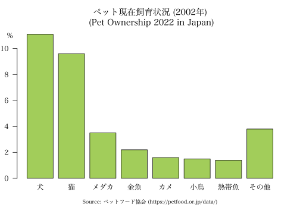

```{r setup, include = FALSE}
knitr::opts_chunk$set(
  collapse = TRUE,
  comment = "#>"
)
oldopt <- options(width = 120)
if(capabilities("cairo"))
    knitr::opts_chunk$set(dev.args = list(png  = list(type = "cairo")))
```

The kanjistat package offers tools for working with Japanese kanji characters, which includes
dictionary lookup, linguistic study, statistical analysis, integration in plots and R objects, as well
as recreational use. This vignette explains the basic functionality.

## Working with kanji in the R console

Many functions in kanjistat take "a kanji" as input. If you have set up a Japanese input method on your system or if you copy/paste characters from somewhere (e.g., an online dictionary), you can pass the kanji directly as a character object. 
```{r message=FALSE}
library(kanjistat)
lookup("猫")  
```
Alternatively, you can use the kanji's Unicode codepoint (if known).
```{r error=TRUE}
"\u732b"
lookup("\u732b")
```
It seems that only Unicode codepoints in the range 0000-ffff can be escaped like this. From the 13108 kanji in KANJIDIC2, this currently excludes only 303. The function `codepointToKanji` helps in this case.
```{r}
# "\u{26951}" gives usually Error: invalid \u{xxxx} sequence
codepointToKanji("26951")
```
Whether this or any other (of the rarer) kanji are displayed correctly still depends on whether the console font supports the corresponding character.


## Kanji data included

Kanjistat comes with a certain amount of data on kanji. The tibbles `kbase`, `kmorph` and the list `kreadmean` provide basic information for the kanji, which is mostly from [KANJIDIC2](https://www.edrdg.org/wiki/index.php/KANJIDIC_Project) (see `README.md` for all sources). For one or several given kanji the information is most easily retrieved via the `lookup` function.

```{r}
lookup("猫")
lookup(c("猫","犬"), "basic")
lookup(c("猫","犬"), "morphologic")
```

Search and selection of kanji is by the usual syntax for data.frames or tibbles. E.g.,
```{r message = FALSE}
kbase[kbase$strokes > 30,]

if (require(dplyr)) {
  kbase %>% filter(strokes > 30)
}
```

## Getting more kanji data 

On the to-do-list for this package are convenience functions for reading from common free kanji databases and transforming the data into a suitable R format. Except for [KanjiVG](https://kanjivg.tagaini.net/) (see next section), this has not been implemented yet.

## Kanji data types

`kanjistat` introduces the S3 classes `kanjimat` and `kanjivec` to store kanji as bitmaps and nested lists of stroke paths, respectively. The former are produced by the user via the function `kanjimat`, specifing a font-family and possibly further parameters. The latter may be produced by the user via the function `kanjivec` based on data of the fantastic [KanjiVG project](https://kanjivg.tagaini.net/). For the Jōyō kanji, there is also a precompiled list available from the [kanjistat.data repository](https://github.com/dschuhmacher/kanjistat.data), which may be the more convenient choice.


## Working with Japanese fonts

For using Japanese script in plots, either for annotation, to depict decomposition information or when producing bitmaps of kanji, you need to tell kanjistat about Japanese fonts installed on your computer.   

There are many free Japanese fonts available for download, including those at <https://www.freekanjifonts.com/>, <https://www.freejapanesefont.com/>, and <https://github.com/fontworks-fonts>. Common terms for font styles are Gothic (ゴシック, sans serif), Minchō (明朝, serif), Kyōkasho (教科書, school textbook). Sho (書) generally indicates a handwriting style, with the three main calligraphy styles being Kaisho (楷書, regular script), Gyōsho (行書, semi-cursiv script), Sōsho (草書, cursiv script). Sometimes the kanji 体 (-tai, for typeface) or something else expressing style or type is added.

Follow the instructions for your operation system to install your favorite fonts. You then need to make R aware of it, which is done via the font management package `sysfonts`. The function `sysfonts::font_files()` gives a list of fonts installed in standard places on your operating system, but the list may be a little overwhelming and it sometimes misses fonts that you have installed in more special places. A useful tool for finding the path to a font you know by name is `systemfonts::match_font` (not `sysfonts`!). You may then add the font to the sysfonts database.

Since installed font families and their locations depend on the user's operating system and setup, the remainder of this introduction displays console output and plots from the author's system.
```{r eval=FALSE}
# Pregenerated output, run on the author's system. Your mileage may vary.

# Locate the free kaisho font by Nagayama Norio (previously installed)
nagayama <- systemfonts::match_font("nagayama_kai")
nagayama
#> $path
#> [1] "/Users/dschuhm/Library/Fonts/nagayama_kai08.otf"
#> 
#> $index
#> [1] 0
#> 
#> $features
#> NULL
hsans <- systemfonts::match_font("Hiragino Sans")
hmincho <- systemfonts::match_font("Hiragino Mincho ProN")
yukyokasho <- systemfonts::match_font("YuKyokasho")

# Add the font to the sysfonts database under the name given by `family`
sysfonts::font_add(family = "nagayama_kai", regular=nagayama$path)
sysfonts::font_add(family = "hiragino_sans", regular=hsans$path)
sysfonts::font_add(family = "hiragino_mincho", regular=hmincho$path)
sysfonts::font_add(family = "yu_kyokasho", regular=yukyokasho$path)

# Display the fonts families in the sysfonts database
sysfonts::font_families()
#> [1] "sans"            "serif"           "mono"            "nagayama_kai"    "hiragino_sans"   "hiragino_mincho" "yu_kyokasho"
```

```{r echo = FALSE, eval = FALSE}
require(systemfonts)
# looking for the free kaisho font by Nagayama Norio we have previously installed
nagayama <- systemfonts::match_font("nagayama_kai")
nagayama
hsans <- systemfonts::match_font("Hiragino Sans")
hmincho <- systemfonts::match_font("Hiragino Mincho ProN")
yukyokasho <- systemfonts::match_font("YuKyokasho")
  
sysfonts::font_add(family = "nagayama_kai", regular=nagayama$path)
sysfonts::font_add(family = "hiragino_sans", regular=hsans$path)
sysfonts::font_add(family = "hiragino_mincho", regular=hmincho$path)
sysfonts::font_add(family = "yu_kyokasho", regular=yukyokasho$path)
  
sysfonts::font_families()
# showtext_auto()    # sees to it that showtext gets used when we say text below
# showtext_auto(enable = FALSE)
```

&#x26A0;️ **Adding fonts to the sysfont database is only effective until the end of the session. It is therefore advisable to add the `font_add` commands to your kanjistat profile file; see the last section of this document.**

Once the fonts are in the sysfonts database, we can use them in plots in many ways we like thanks to the package `showtext`. A first obvious example is for plot annotation.
<!-- for a single kanji take width and height = 3 -->
```{r eval=FALSE, fig.align='left', fig.height=5, fig.width=7, fig.showtext=TRUE, message=FALSE}
# Pregenerated output, run on the author's system. Your mileage may vary.

showtext::showtext_auto()  # give control for displaying text in plots to package `showtext`
par(mai=c(0.8, 0.4, 0.8, 0.4))

# data
petpercent <- c(11.1, 9.6, 3.5, 2.2, 1.6, 1.5, 1.4, 0.7, 0.6, 0.5, 0.4, 0.4, 0.3, 0.2, 0.1, 0.1, 0.5)
petshort <- c(petpercent[1:7], sum(petpercent[8:17]))
petnames <- c("犬", "猫", "メダカ", "金魚", "カメ", "小鳥", "熱帯魚", "その他")

# plot and annotate
barplot(petshort, las=1, col="darkolivegreen3", # names.arg=petnames does not position nicely
        main="ペット現在飼育状況 (2002年)\n (Pet Ownership 2022 in Japan)", family="hiragino_mincho")
mtext(petnames, side=1, line=0.35, at=-0.5 + 1.2*(1:8), family="hiragino_mincho")
  # bars have width 1 and space 0.2
mtext("%", side=2, line=0.5, at=11, las=1, family="hiragino_mincho")
mtext("Source: ペットフード協会 (https://petfood.or.jp/data/)", side=1, line=2, family="hiragino_mincho", cex=0.75)

showtext::showtext_auto(enable = FALSE)  # give back control to the usual R code
```

{width=100%}

The function `plotkanji` provides a simple way of depicting individual kanji in a graphics device. 
```{r message=FALSE, eval=FALSE, fig.align='left', fig.height=2, fig.width=8, fig.showtext=TRUE, message=FALSE}
# Pregenerated output, run on the author's system. Your mileage may vary.
plotkanji(rep("猫",4), family=c("hiragino_sans", "hiragino_mincho", "yu_kyokasho", "nagayama_kai"), height=2)
```

```{r message=FALSE, echo=FALSE, eval=FALSE, fig.align='left', fig.height=2, fig.width=8, fig.showtext=TRUE, message=FALSE}
plotkanji(rep("猫",4), device="png", filename="four_cats.png",
          family=c("hiragino_sans", "hiragino_mincho", "yu_kyokasho", "nagayama_kai"), factor=40, width=1536, height=384)
```
{width=90%}

## kanjimat objects

The function `kanjimat` produces a bitmap representation of the kanji in the specified font that is stored in an object of class `kanjimat` along with other information.

```{r echo=FALSE, eval=FALSE, fig.align='left', fig.height=2, fig.showtext=TRUE, fig.width=8, message=FALSE}
# Pregenerated output, run on the author's system. Your mileage may vary.
fuji <- kanjimat(kanji="藤", family="nagayama_kai", size = 128)
fuji
str(fuji)
plot(fuji)
```

```{r message=FALSE, eval=FALSE}
# Pregenerated output, run on the author's system. Your mileage may vary.
fuji <- kanjimat(kanji="藤", family="nagayama_kai", size = 128)
fuji
#> Kanjimat representation of 藤 (Unicode 85e4)
#> 128x128 bitmap in nagayama_kai font with 0 margin, antialiased
str(fuji)
#> List of 8
#>  $ char     : chr "藤"
#>  $ hex      : 'hexmode' int 85e4
#>  $ padhex   : chr "085e4"
#>  $ family   : chr "nagayama_kai"
#>  $ size     : num 128
#>  $ margin   : num 0
#>  $ antialias: logi TRUE
#>  $ matrix   : num [1:128, 1:128] 0 0 0 0 0 0 0 0 0 0 ...
#>  - attr(*, "call")= chr "kanjimat(kanji = \"藤\", family = \"nagayama_kai\", size = 128)"
#>  - attr(*, "kanjistat_version")=Classes 'package_version', 'numeric_version'  hidden list of 1
#>   ..$ : int [1:3] 0 8 0
#>  - attr(*, "Rversion")= chr "R version 4.3.0 (2023-04-21)"
#>  - attr(*, "platform")= chr "x86_64-apple-darwin20"
#>  - attr(*, "png_type")= chr "cairo"
#>  - attr(*, "class")= chr "kanjimat"
plot(fuji)
```


## The kanjistat profile file

When kanjistat is loaded, it tries to source the file `.Rkanjistat-profile`, first from the current
R working directory and if none is found from the users home directory. Having such a file is optional
but can be helpful in particular for the following three tasks:

* Adding fonts to the `sysfonts` database as described above for the duration of the current R session. 
For this, include lines of the form
```r
sysfonts::font_add(family = "nagayama_kai", regular="/Users/dschuhm/Library/Fonts/nagayama_kai08.otf")
```
where `regular` is obtained from `systemfonts::match_font`.

* Setting kanjistat options via `kanjistat_options`. Options are mostly default choices for various functions. These options are mentioned in the help of the function. Example:
```r
kanjistat_options(ask_github = TRUE, default_bitmap_size = 64, default_font = "yu_kyokasho")
```

* Loading further kanji data. For now, this concerns mainly the list of pregenerated kanjivec objects obtained from [kanjistat.data repository](https://github.com/dschuhmacher/kanjistat.data). After saving the .rda file locally, load by adding the following line to `.Rkanjistat-profile`
```r
load("/path/to/the/data/kvec.rda", envir = .GlobalEnv)
```

 
